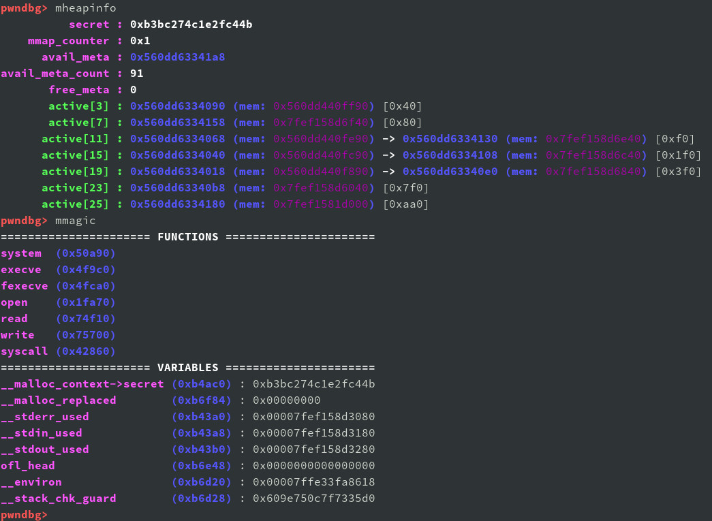
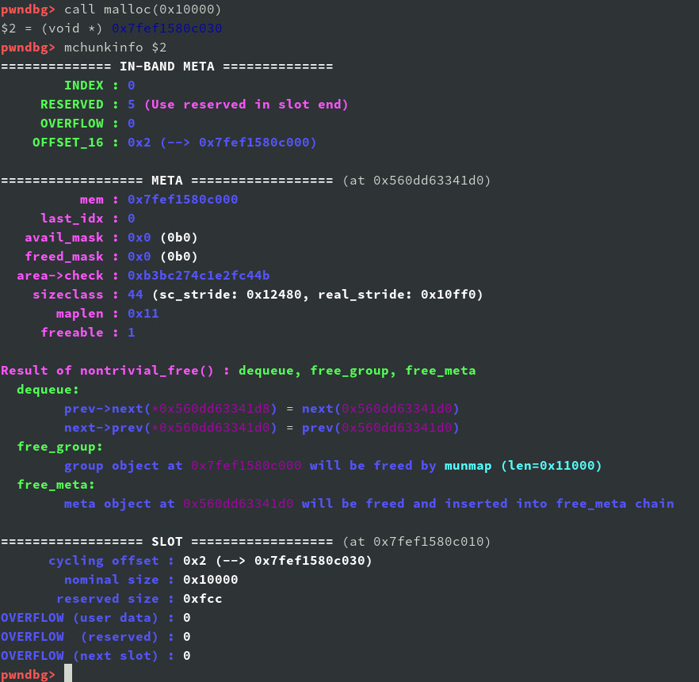
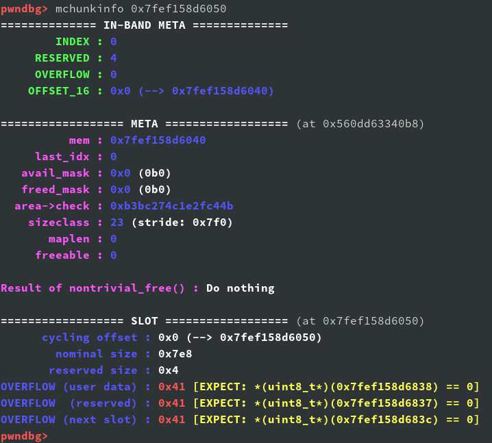
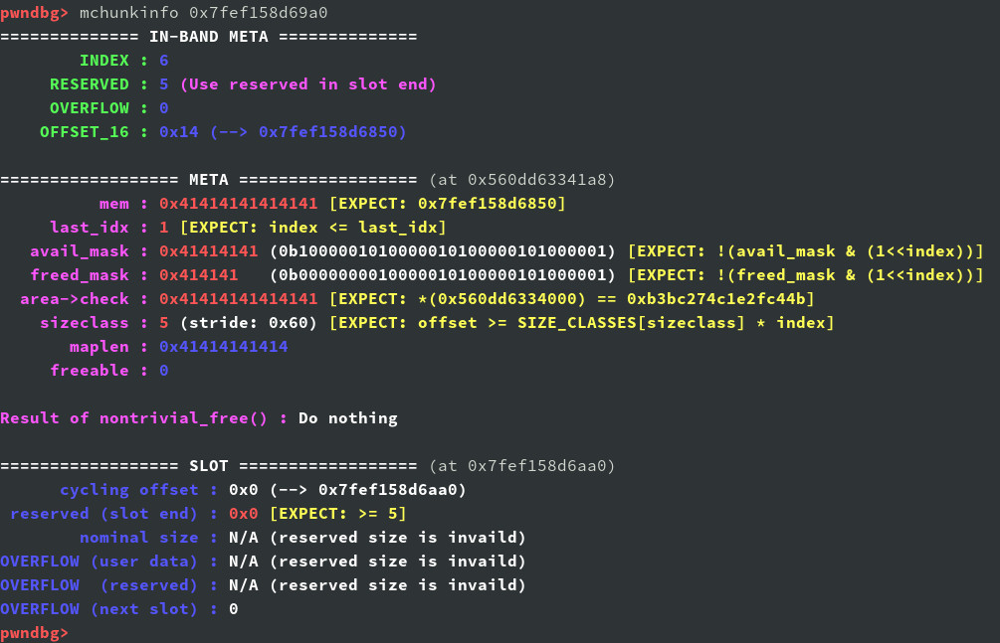

# muslheap

**muslheap** is a simple [GDB](https://www.gnu.org/software/gdb/) plug-in for inspecting mallocng.

This plugin provides additional GDB commands to invalidate mallocng global states and internal data structures (slot, group, meta and so on).

## What is mallocng

**mallocng** is a new dynamic memory allocator in [musl libc](https://musl.libc.org/) v1.2.1+, aiming to provide strong hardening against common memory usage errors such as overflows, double-free, and use-after-free.

The High-level design

(from [mallocng-draft](https://github.com/richfelker/mallocng-draft#high-level-design))

1. Memory organized dynamically into small slab-style groups of up to 32 identical-size allocation units with status controlled by bitmasks.

2. Utilize a mix of in-band and out-of-band metadata to isolate sensitive state from regions easily accessible through out-of-bounds writes.

3. Smalle allocations come from groups of one of 48 size classes, while large allocations are made individually by mmap treated as special one-member groups.

4. The first 8 size classes are spaced linearly up to 128, then roughly geometrically with four steps per doubling adjusted to divide powers of two with minimal remainder (waste).

5. Base allocation granularity and alignment is 16 bytes.

## Installation

`echo "source /path/to/muslheap.py" >> ~/.gdbinit`

Requirements:
* **Python 3.5.2+**
* **GDB 7.11.1+** with python3 support
* **musl libc 1.2.1+** with debug symbols
  * Ubuntu: `apt install musl-dbgsym`
  * Alpine: `apk add musl-dbg`

Older versions of Python and GDB are untested and may not work as expected.

## Features

* `mchunkinfo`: Examine a mallocng-allocated memory (slot)
  * in-band meta and out-band meta (`struct meta` object)
  * slot infomation (size, reversed size, overflow bytes)
  * the predictive result of [`nontrivial_free()`](http://git.musl-libc.org/cgit/musl/tree/src/malloc/mallocng/free.c?h=v1.2.2#n140) call in `free()`

* `mheapinfo`: Display infomation of mallocng allocator.

* `mmagic`: Display useful variables and functions in musl libc.

## Screenshots

* Display musl-libc and mallocng allocator infomation：

* Examine mallocng memory：

* Examine overflowed memory：

* Examine memory with corrupted `struct meta` object：

## References

* [mallocng source code](http://git.musl-libc.org/cgit/musl/tree/src/malloc/mallocng?h=v1.2.2)
* [mallocng-draft](https://github.com/richfelker/mallocng-draft)

## License

The MIT License (MIT)
